# document-level-classification

超长文本分类，解决长距离依赖问题。

- **DPCNN**
- **HAN**
- **XLNet + 层次attention + fc**
- **Bert + overlap_split分段 + BiLSTM + fc**

## 实验环境
|环境 | 版本/型号|
---|---
python| 3.6.9
pytorch| 1.7.0
cuda | 10.2
gpu| NVIDIA V100 (32G) x 4张

## 数据集说明

清华数据集 [thucnews](http://thuctc.thunlp.org/)
本次训练使用了其中的10个分类，类别如下：

`体育, 财经, 房产, 家居, 教育, 科技, 时尚, 时政, 游戏, 娱乐`

- cnews.train.txt: 训练集(50000条)
- cnews.val.txt: 验证集(5000条)
- cnews.test.txt: 测试集(10000条)

## 1. DPCNN
论文：[DPCNN：Deep Pyramid Convolutional Neural Networks for Text Categorization](https://ai.tencent.com/ailab/media/publications/ACL3-Brady.pdf)

模型架构图：

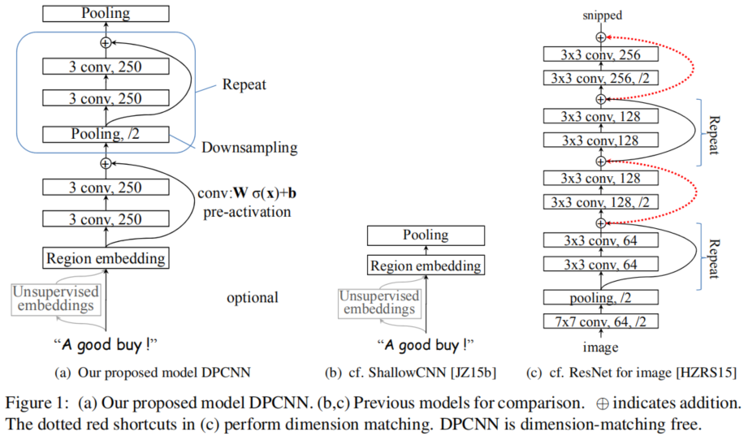
### 训练

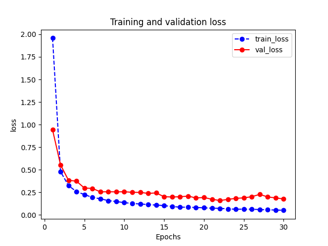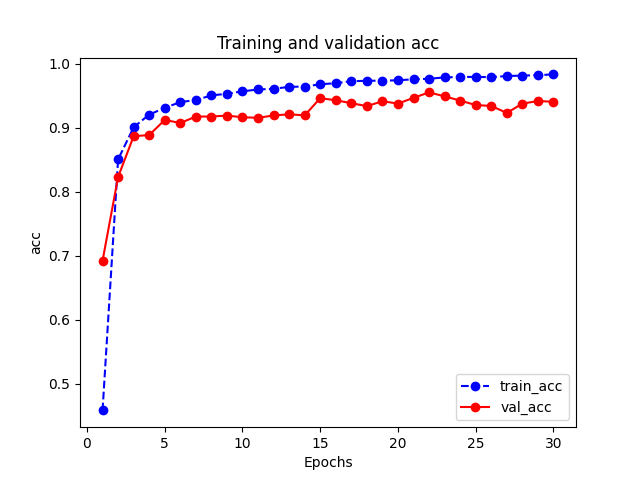


#### 部分训练log:
````
Total params: 3,723,760
Trainable params: 3,723,760
Non-trainable params: 0
----------------------------------------------------------------
Input size (MB): 0.001907
Forward/backward pass size (MB): 11.211472
Params size (MB): 14.205017
Estimated Total Size (MB): 25.418396
----------------------------------------------------------------
********** sample_out: torch.Size([512, 10])
*************************** start training...

================================================================================2021-03_03 04:27:17
*************************** [step = 50] loss: 2.768, acc: 0.275
EPOCH = 1 loss: 1.958, acc: 0.459, val_loss: 0.942, val_acc: 0.692

================================================================================2021-03_03 04:27:51
*************************** [step = 50] loss: 0.545, acc: 0.829
EPOCH = 2 loss: 0.479, acc: 0.850, val_loss: 0.554, val_acc: 0.823

================================================================================2021-03_03 04:28:23
*************************** [step = 50] loss: 0.340, acc: 0.895
EPOCH = 3 loss: 0.324, acc: 0.901, val_loss: 0.383, val_acc: 0.887

================================================================================2021-03_03 04:28:50
...
...
...
==============================================================================2021-03_03 04:37:39
*************************** [step = 50] loss: 0.053, acc: 0.982
EPOCH = 28 loss: 0.055, acc: 0.981, val_loss: 0.198, val_acc: 0.937

================================================================================2021-03_03 04:38:00
*************************** [step = 50] loss: 0.051, acc: 0.983
EPOCH = 29 loss: 0.053, acc: 0.982, val_loss: 0.188, val_acc: 0.942

================================================================================2021-03_03 04:38:22
*************************** [step = 50] loss: 0.048, acc: 0.984
EPOCH = 30 loss: 0.049, acc: 0.983, val_loss: 0.176, val_acc: 0.940

================================================================================2021-03_03 04:38:43
*************************** training finished...
*************************** and it costs 0 h 11 min 26.57 s
Best val Acc: 0.954974
````

### 测试

测试集上平均F1_score 达到了 `0.97`，还是不错的！
````
*************************** start evaluating...

================================================================================2021-03_03 05:18:59
evaluating costs: 16.94s
*************************** weighted_precision_score:0.970
*************************** weighted_recall_score:0.97
*************************** weighted_f1_score:0.970
*************************** accuracy:0.970
*************************** confusion_matrix:
 [[998   0   0   0   1   0   0   0   1   0]
 [  0 972  11   0   4   6   3   3   1   0]
 [  0   0 957   8   2   9   8   4   4   8]
 [  0   1   8 961   1   2  12   0   0  15]
 [  0   0  20   0 917   7  25  13   9   9]
 [  0   2  22   0   1 973   0   0   0   2]
 [  1   1   3   1   5   2 982   1   2   2]
 [  0   0   4   0   2   7   0 985   2   0]
 [  0   0  20   0   0   2   2   7 969   0]
 [  0   0   3   5   0   0   7   0   0 985]]
*************************** classification_report:
               precision    recall  f1-score   support

           0       1.00      1.00      1.00      1000
           1       1.00      0.97      0.98      1000
           2       0.91      0.96      0.93      1000
           3       0.99      0.96      0.97      1000
           4       0.98      0.92      0.95      1000
           5       0.97      0.97      0.97      1000
           6       0.95      0.98      0.96      1000
           7       0.97      0.98      0.98      1000
           8       0.98      0.97      0.97      1000
           9       0.96      0.98      0.97      1000

    accuracy                           0.97     10000
   macro avg       0.97      0.97      0.97     10000
weighted avg       0.97      0.97      0.97     10000

````

## 2. HAN
论文：[HAN：Hierarchical Attention Networks for Document Classification](https://www.aclweb.org/anthology/N16-1174/)

模型架构图：

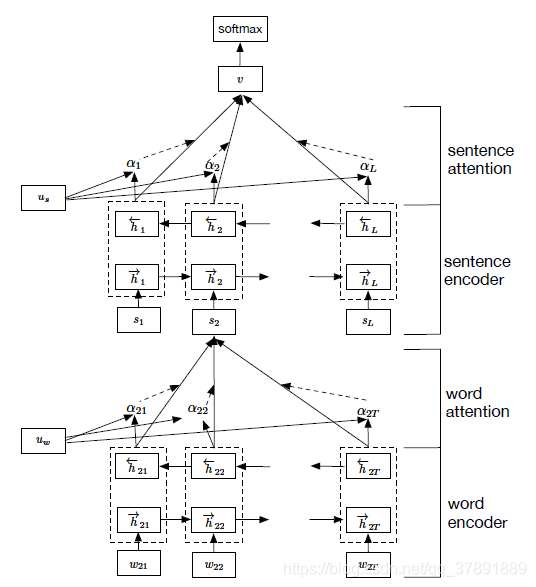

### 训练

从学习曲线来看，模型在epoch=7时在验证集上效果最好，后面的训练中开始有一丢丢的过拟合了。
可以将学习率再调小一些，后面再找时间，继续优化一下。

后面的测试集上f1_score达到0.96

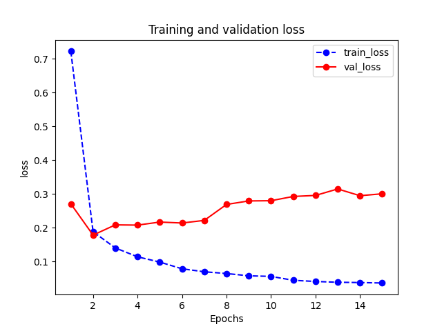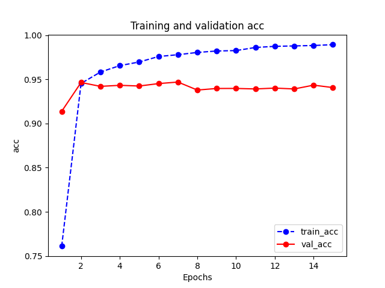

#### 部分训练log:
````
Total params: 756,370
Trainable params: 756,370
Non-trainable params: 0
----------------------------------------------------------------
Input size (MB): 0.003433
Forward/backward pass size (MB): 1.484779
Params size (MB): 2.885323
Estimated Total Size (MB): 4.373535
----------------------------------------------------------------
********** sample_out: torch.Size([512, 10])
*************************** start training...

================================================================================2021-03_16 09:34:13
*************************** [step = 50] loss: 1.121, acc: 0.620
EPOCH = 1 loss: 0.722, acc: 0.761, val_loss: 0.271, val_acc: 0.914

================================================================================2021-03_16 09:34:52
*************************** [step = 50] loss: 0.201, acc: 0.943
EPOCH = 2 loss: 0.188, acc: 0.945, val_loss: 0.178, val_acc: 0.946

================================================================================2021-03_16 09:35:27
*************************** [step = 50] loss: 0.141, acc: 0.958
EPOCH = 3 loss: 0.140, acc: 0.958, val_loss: 0.208, val_acc: 0.942

================================================================================2021-03_16 09:35:59
...
...
...
================================================================================2021-03_16 09:41:25
*************************** [step = 50] loss: 0.038, acc: 0.988
EPOCH = 14 loss: 0.038, acc: 0.988, val_loss: 0.295, val_acc: 0.943

================================================================================2021-03_16 09:42:00
*************************** [step = 50] loss: 0.037, acc: 0.989
EPOCH = 15 loss: 0.036, acc: 0.989, val_loss: 0.301, val_acc: 0.941

================================================================================2021-03_16 09:42:32
*************************** training finished...
*************************** and it costs 0 h 8 min 19.69 s
Best val Acc: 0.946891
````

### 测试

测试集上平均F1_score 达到了 `0.96`，还是不错的！
````
*************************** start evaluating...

================================================================================2021-03_16 09:47:01
evaluating costs: 51.37s
*************************** weighted_precision_score:0.961
*************************** weighted_recall_score:0.96
*************************** weighted_f1_score:0.960
*************************** accuracy:0.960
*************************** confusion_matrix:
 [[998   0   0   0   0   0   1   1   0   0]
 [  0 987   2   0   3   4   0   1   3   0]
 [  0   0 908  35   3  16   9   8   9  12]
 [  0   1  18 904   5   1  24   1   2  44]
 [  1   1   1   8 907   6   6  30  25  15]
 [  0   1  17   0   2 980   0   0   0   0]
 [  0   0   0  13   6   1 962   2   8   8]
 [  0   1   3   0   1   4   0 980  10   1]
 [  0   1   3   0   2   7   1   5 981   0]
 [  0   0   0   2   0   0   2   0   0 996]]
*************************** classification_report:
               precision    recall  f1-score   support

           0       1.00      1.00      1.00      1000
           1       0.99      0.99      0.99      1000
           2       0.95      0.91      0.93      1000
           3       0.94      0.90      0.92      1000
           4       0.98      0.91      0.94      1000
           5       0.96      0.98      0.97      1000
           6       0.96      0.96      0.96      1000
           7       0.95      0.98      0.97      1000
           8       0.95      0.98      0.96      1000
           9       0.93      1.00      0.96      1000

    accuracy                           0.96     10000
   macro avg       0.96      0.96      0.96     10000
weighted avg       0.96      0.96      0.96     10000
````
## 3. XLNet + 层次attention + fc
XLNet论文：[XLNet: Generalized Autoregressive Pretraining for Language Understanding](https://arxiv.org/abs/1906.08237)

XLNet中文预训练模型下载地址：[https://mirrors-i.tuna.tsinghua.edu.cn/hugging-face-models/hfl/chinese-xlnet-base/](https://mirrors-i.tuna.tsinghua.edu.cn/hugging-face-models/hfl/chinese-xlnet-base/)

模型架构图：

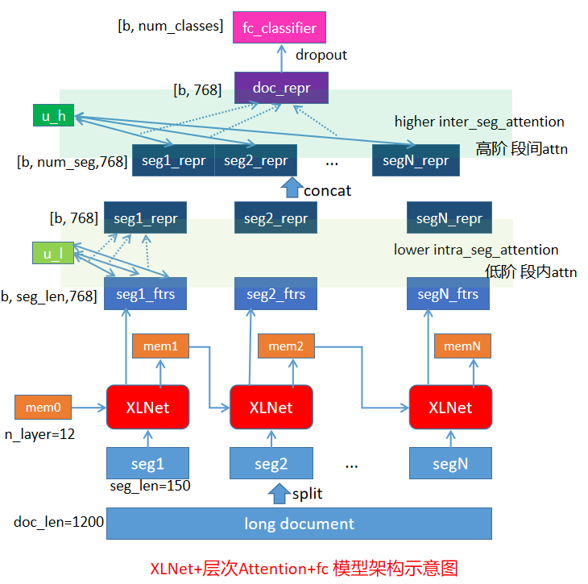

### 训练

因为预训练模型xlnet的参数之多，虽然它并没有参与训练，只是作为特征提取器使用，但是其forward的计算时间也是相对比较久的，
所以整个训练花的时间大概是`4.5h`。（注意：我是4张V100的gpu卡，如果你只有1张卡，训练的时间必然会更长）

从学习曲线来看，在epoch=11时模型在验证集效果最好。

后面的测试集上f1_score达到0.974

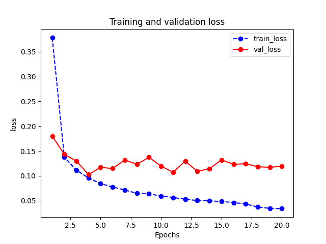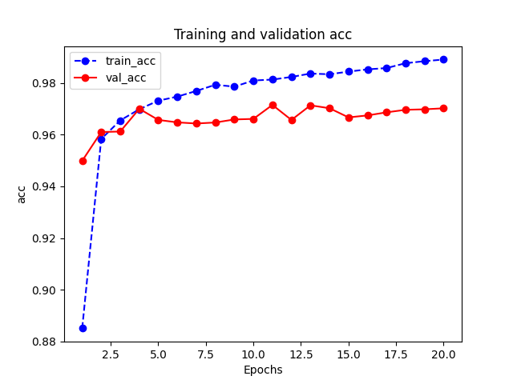

#### 部分训练log:

````
********** sample_out: torch.Size([256, 10])
Params to learn:
*************************** start training...

================================================================================2021-06_20 08:23:26
*************************** [step = 50] loss: 0.909, acc: 0.718
*************************** [step = 100] loss: 0.572, acc: 0.826
*************************** [step = 150] loss: 0.443, acc: 0.865
EPOCH = 1 loss: 0.378, acc: 0.885, val_loss: 0.180, val_acc: 0.950

================================================================================2021-06_20 08:45:40
*************************** [step = 50] loss: 0.156, acc: 0.953
*************************** [step = 100] loss: 0.149, acc: 0.955
*************************** [step = 150] loss: 0.141, acc: 0.958
EPOCH = 2 loss: 0.138, acc: 0.958, val_loss: 0.144, val_acc: 0.961

================================================================================2021-06_20 09:06:19
*************************** [step = 50] loss: 0.122, acc: 0.962
*************************** [step = 100] loss: 0.114, acc: 0.964
*************************** [step = 150] loss: 0.112, acc: 0.965
EPOCH = 3 loss: 0.111, acc: 0.965, val_loss: 0.130, val_acc: 0.961

================================================================================2021-06_20 09:26:33
...
...
...
================================================================================2021-06_20 12:29:44
*************************** [step = 50] loss: 0.035, acc: 0.988
*************************** [step = 100] loss: 0.035, acc: 0.989
*************************** [step = 150] loss: 0.036, acc: 0.988
EPOCH = 19 loss: 0.034, acc: 0.988, val_loss: 0.117, val_acc: 0.970

================================================================================2021-06_20 12:41:36
*************************** [step = 50] loss: 0.037, acc: 0.989
*************************** [step = 100] loss: 0.036, acc: 0.988
*************************** [step = 150] loss: 0.036, acc: 0.988
EPOCH = 20 loss: 0.034, acc: 0.989, val_loss: 0.119, val_acc: 0.970

================================================================================2021-06_20 12:53:23
*************************** training finished...
*************************** and it costs 4 h 29 min 57.16 s
Best val Acc: 0.971484
````
### 测试

````
*************************** start evaluating...

================================================================================2021-06_20 13:00:58
evaluating costs: 106.59s
*************************** weighted_precision_score:0.974
*************************** weighted_recall_score:0.974
*************************** weighted_f1_score:0.974
*************************** accuracy:0.974
*************************** confusion_matrix:
 [[998   0   0   0   1   0   1   0   0   0]
 [  0 979  10   0   3   3   1   1   3   0]
 [  0   0 934  42   2  10   2   2   3   5]
 [  0   1   8 957   5   1  15   0   0  13]
 [  2   0   3   0 959   2   5   3  21   5]
 [  0   1   8   0   6 984   1   0   0   0]
 [  0   2   2  12   7   0 959   1   9   8]
 [  0   1   0   0   1   6   0 988   4   0]
 [  0   0  13   0   0   3   0   2 982   0]
 [  0   0   0   2   0   0   0   0   0 998]]
*************************** classification_report:
               precision    recall  f1-score   support

           0       1.00      1.00      1.00      1000
           1       0.99      0.98      0.99      1000
           2       0.96      0.93      0.94      1000
           3       0.94      0.96      0.95      1000
           4       0.97      0.96      0.97      1000
           5       0.98      0.98      0.98      1000
           6       0.97      0.96      0.97      1000
           7       0.99      0.99      0.99      1000
           8       0.96      0.98      0.97      1000
           9       0.97      1.00      0.98      1000

    accuracy                           0.97     10000
   macro avg       0.97      0.97      0.97     10000
weighted avg       0.97      0.97      0.97     10000
````

测试集上平均F1_score 达到了 `0.974`，还是不错的！


## 4. Bert + overlap_split分段 + BiLSTM + fc
Bert论文：[BERT: Pre-training of Deep Bidirectional Transformers for Language Understanding](https://arxiv.org/abs/1810.04805)

Bert中文预训练模型下载地址：[https://mirrors-i.tuna.tsinghua.edu.cn/hugging-face-models/hfl/chinese-bert-wwm-ext/](https://mirrors-i.tuna.tsinghua.edu.cn/hugging-face-models/hfl/chinese-bert-wwm-ext/)

模型架构图：

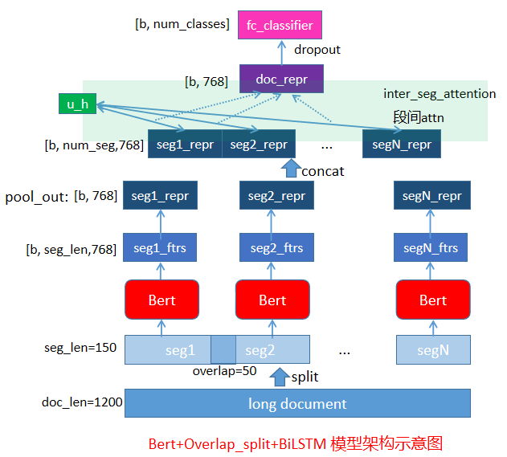

overlap_split的想法参考自这篇博客：[基于BERT的超长文本分类模型](https://blog.csdn.net/valleria/article/details/105311340)
，但是原博文中实现时是分成`两阶段`，
分开执行的，而且现在的实现是`端到端(end-to-end)`的，在应用时更加方便和简洁了。

### 训练

因为预训练模型bert的参数之多，虽然它并没有参与训练，只是作为特征提取器使用，但是其forward的计算时间也是相对比较久的，
所以整个训练花的时间大概是`2.5h`。（注意：我是4张V100的gpu卡，如果你只有1张卡，训练的时间必然会更长）

从学习曲线来看，在epoch=18时模型在验证集效果最好。看图感觉还可以把drop_rate设置小一点，结果可能会更好，
后面有时间了再尝试一下。

后面的测试集上f1_score达到0.951

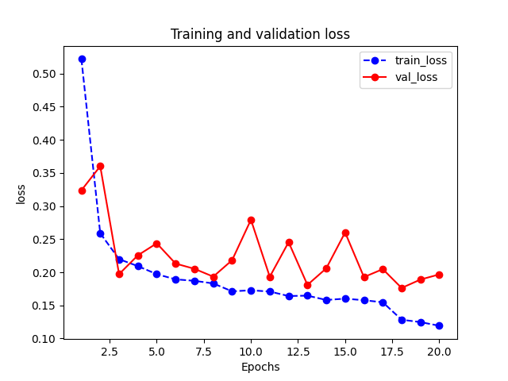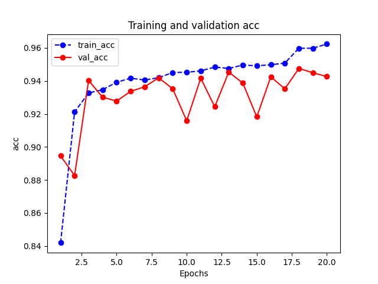

#### 部分训练log:

````
********** sample_out: torch.Size([256, 10])
Params to learn:
*************************** start training...

================================================================================2021-06_20 13:12:32
*************************** [step = 50] loss: 1.091, acc: 0.675
*************************** [step = 100] loss: 0.735, acc: 0.780
*************************** [step = 150] loss: 0.597, acc: 0.820
EPOCH = 1 loss: 0.522, acc: 0.842, val_loss: 0.324, val_acc: 0.895

================================================================================2021-06_20 13:19:11
*************************** [step = 50] loss: 0.271, acc: 0.916
*************************** [step = 100] loss: 0.260, acc: 0.920
*************************** [step = 150] loss: 0.261, acc: 0.920
EPOCH = 2 loss: 0.259, acc: 0.921, val_loss: 0.360, val_acc: 0.883

================================================================================2021-06_20 13:26:47
*************************** [step = 50] loss: 0.235, acc: 0.927
*************************** [step = 100] loss: 0.228, acc: 0.930
*************************** [step = 150] loss: 0.224, acc: 0.931
EPOCH = 3 loss: 0.220, acc: 0.933, val_loss: 0.197, val_acc: 0.940

================================================================================2021-06_20 13:34:27
...
...
...
================================================================================2021-06_20 15:28:24
*************************** [step = 50] loss: 0.128, acc: 0.960
*************************** [step = 100] loss: 0.125, acc: 0.959
*************************** [step = 150] loss: 0.127, acc: 0.959
EPOCH = 19 loss: 0.125, acc: 0.960, val_loss: 0.189, val_acc: 0.945

================================================================================2021-06_20 15:36:01
*************************** [step = 50] loss: 0.122, acc: 0.962
*************************** [step = 100] loss: 0.119, acc: 0.963
*************************** [step = 150] loss: 0.120, acc: 0.962
EPOCH = 20 loss: 0.119, acc: 0.962, val_loss: 0.197, val_acc: 0.943

================================================================================2021-06_20 15:43:37
*************************** training finished...
*************************** and it costs 2 h 31 min 4.92 s
Best val Acc: 0.947553
````

### 测试
````
*************************** start evaluating...

================================================================================2021-06_20 16:05:42
evaluating costs: 60.85s
*************************** weighted_precision_score:0.951
*************************** weighted_recall_score:0.951
*************************** weighted_f1_score:0.951
*************************** accuracy:0.951
*************************** confusion_matrix:
 [[993   1   0   0   2   1   2   1   0   0]
 [  1 977   3   0   1   4   0   5   8   1]
 [  0   7 838  92   6  18  10   5   9  15]
 [  1   4  17 894  11   5  34   1   4  29]
 [  2   1   5   6 923   3  18   4  34   4]
 [  0   6  13   0   6 972   1   0   1   1]
 [  0   2   1  18   3   0 962   1   8   5]
 [  0   2   0   0   3   3   0 987   4   1]
 [  0   1   6   1   2   4   0   4 982   0]
 [  0   0   0  10   1   0   8   0   0 981]]
*************************** classification_report:
               precision    recall  f1-score   support

           0       1.00      0.99      0.99      1000
           1       0.98      0.98      0.98      1000
           2       0.95      0.84      0.89      1000
           3       0.88      0.89      0.88      1000
           4       0.96      0.92      0.94      1000
           5       0.96      0.97      0.97      1000
           6       0.93      0.96      0.95      1000
           7       0.98      0.99      0.98      1000
           8       0.94      0.98      0.96      1000
           9       0.95      0.98      0.96      1000

    accuracy                           0.95     10000
   macro avg       0.95      0.95      0.95     10000
weighted avg       0.95      0.95      0.95     10000
````

测试集上平均F1_score 达到了 `0.951`。